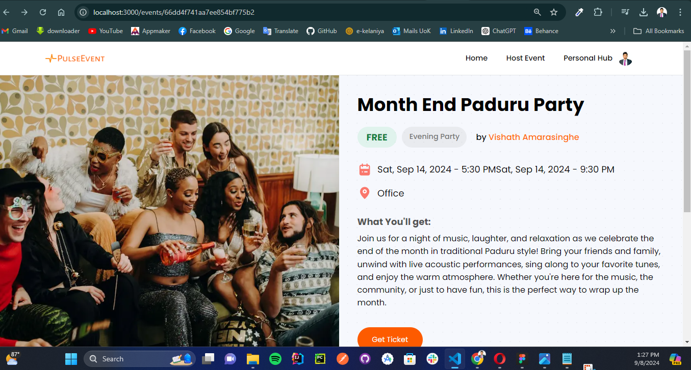

# PulseEvent-Event Management Platfrom

 

 

<h2>Features</h2>
The PulseEvent enables organizations to host events, and post-event articles, and functions as a ticket hub. I integrated various technologies to make it robust:

 

<h2>Technologies</h2>
 
FrontEnd -Next.js for improved performance and SEO.
 
Clerk for authentication.
 
Uploadthing for smooth media uploads.
 
BackEnd -Node.js and Express for server-side functionality.
 
Database- MongoDB Atlas(CRUD operations)
 
Stripe for secure payments.
 
 

